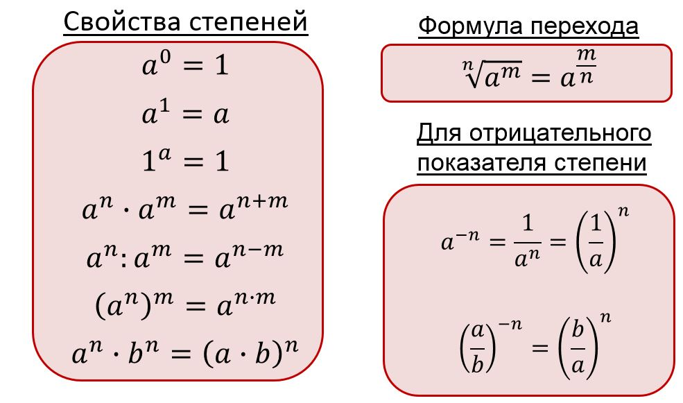
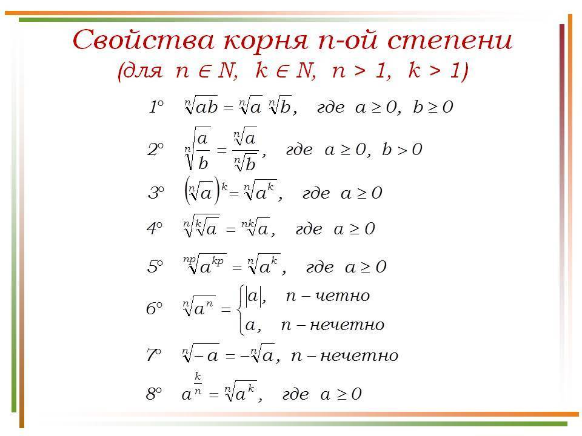
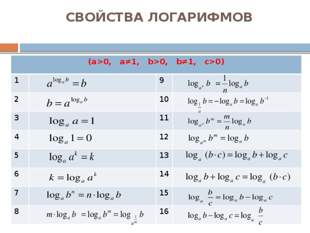
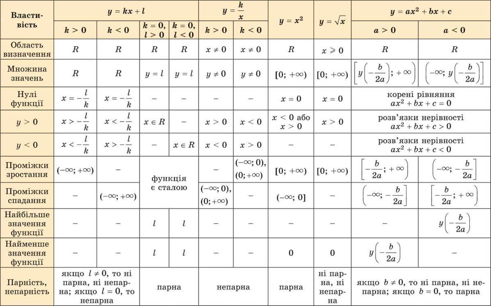
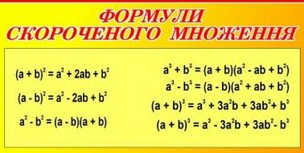
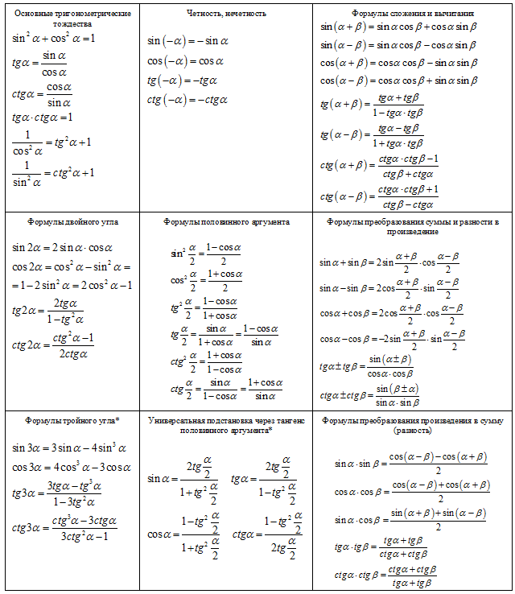
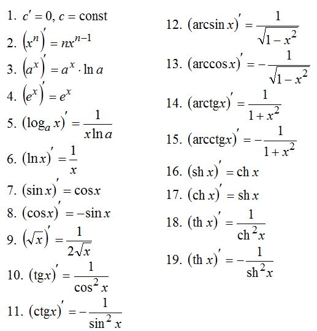
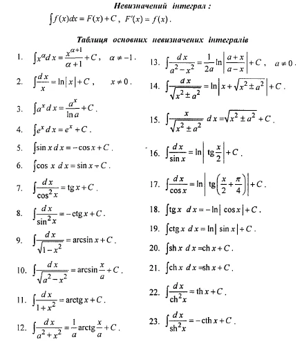
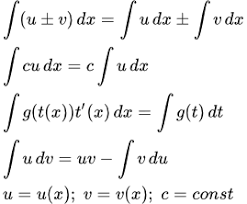

1. Свойства степеней

2. Свойства корней

3. Свойства логарифмов

4. Виды и свойства функций

5. Формулы сокращенного умножения

6. Тригонометрические формулы

7. Таблица производных

8. Таблица неопределенных интегралов

9. Методы интегрирования

