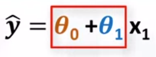

**Superviset Learning (labeled data)**
1. Regression
2. Classification

**Unsupevised Learning (unlabeled data)** 
1. Dimension reduction
2. Density estimation
3. Market basket analysis
4. Clustering

***Regression is the process of predicting a continuous value***

1. Independent variable: x : Can be continuous or discrete or categorical
2. Dependent variable: y  : Must be continuous

1. Simple Linear Regression: One independent variable
3. Simple Non-Linear Regression: One independent variable
3. Multiple Linear Regression: More than one independent variable
4. Multiple Non-Linear Regression: More than one independent variable

***Application of regression***

* Sales forecasting
* Satisfaction analysis
* Price estimation
* Employment income estimation
* etc

***Regression algorithms***

* Ordinal regression
* Linear, Polynomial, Lasso, Stepwise, Ridge regression
* Bayesian linear regression
* Neural network regression
* Decision forest regression
* Boosted decision tree regression
* K-nearest neighbor regression
* Poisson regression
* Fast forest quantile regression
* etc

***Simple linear regression***

1. Simple linear regression: predict co2 emission from engine size
2. Multiple linear regression: predict co2 emission from engine size, cylinders, fuel consumption

MSE = 1/n * sum(yi - y^i)^2 - mean squared error, to improve the model, we need to minimize the MSE

***Pros and Cons of Linear Regression***

1. Pros
    * Simple to implement
    * Easy to interpret
    * Basis for many other methods
    * Computationally inexpensive
    * Model training and prediction are fast
    * No tuning is required (except regularization)
    * Features don't need scaling
    * Can perform well with a small number of observations
    * Well understood
2. Cons
    * Assumes a linear relationship between features and response
    * Performance is (generally) not competitive with the best supervised learning methods
    * Sensitive to irrelevant features
    * Sensitive to outliers
    * Can't automatically learn feature interactions

### Model evaluations approaches

1. Train and test on the same dataset

High training accuracy and low out-of-sample accuracy: Overfitting

2. Train/test split

More accurate estimate of out-of-sample accuracy

Highly dependent on train/test split

### Evaluation metrics for in regression models

1. Mean absolute error (MAE): Mean of absolute value of errors
2. Mean squared error (MSE): Mean of squared errors
3. Root mean squared error (RMSE): Square root of mean of squared errors
4. etc

## Multiple linear regression

* Independent variables effectiveness on prediction
* Predicting impact of changes

Estimating multiple linear regression parameters

1. Ordinary least squares (OLS)
  * linear algebra operations
  * takes a lot of time for large datasets 10k+ rows

2. An optimization algorithm
  * Gradient descent
  * Stochastic gradient descent
  * Properly if dataset is large